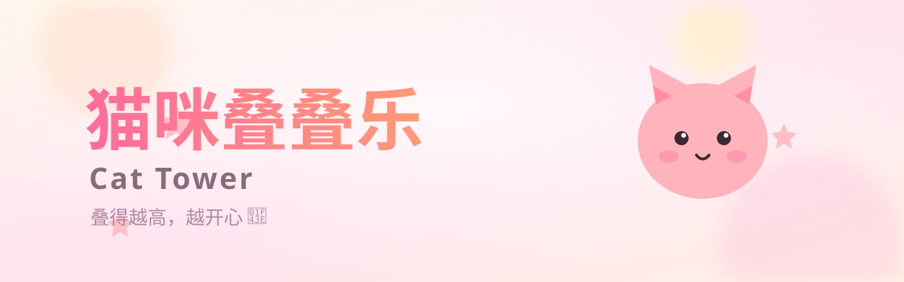

<p align="center">
  
</p>

<h1 align="center">🐱 猫咪叠叠乐 · Cat Tower</h1>

<p align="center">
  <a href="https://uahz.github.io/h5-cat-tower/"></a>
  
  
  
  
  
</p>

<p align="center"><b>用自写的 Verlet 物理引擎，把软萌小猫一只只叠起来——叠得越高，越开心 🐾</b></p>

---

## ✨ 游戏特点

- **真·物理堆叠**：自写 Verlet 积分 + 多轮约束迭代，猫咪之间会真实碰撞、挤压、晃悠，不会穿模。
- **手感丝滑**：固定步长 120fps 主循环，下落与瞄准动画顺滑跟手。
- **零素材零构建**：HTML + CSS + JS 全部内联，没有任何外部依赖，双击即玩。
- **可爱画风**：圆萌猫脸、渐变球体感身体、眨眼与腮红，每一只都不同色。
- **最高分记忆**：用 `localStorage` 记住你的最佳成绩，随时来挑战自己。

## 🎮 玩法

1. 移动手指 / 鼠标，在顶部瞄准落点（虚线会显示当前位置）。
2. 松手投放一只小猫，它会受重力落下、与其它猫和平台碰撞堆叠。
3. 猫咪如果掉出平台边缘就 **Game Over**。
4. 叠得越高分越高，稳稳堆出一座猫塔吧！

> 💡 小技巧：把猫轻轻搭在已有猫堆的“凹槽”里最稳，别全堆一边。

## 🚀 快速开始

直接用浏览器打开 `index.html` 即可游玩。

```bash
# 或起一个本地静态服务器
python3 -m http.server 8080
# 然后访问 http://localhost:8080
```

也可以在手机上打开 **[在线试玩](https://uahz.github.io/h5-cat-tower/)**，竖屏体验最佳。

## 📱 操作 & 适配

| 设备 | 操作 |
| --- | --- |
| 📱 手机 / 平板 | 触摸移动瞄准，松手投放 |
| 💻 电脑 | 鼠标移动瞄准，点击投放 |

- 画布 390 × 720，针对手机竖屏优化，自适应缩放。
- 支持高 DPR 屏幕（最高 3×），图形依旧清晰。

## 🛠 技术栈

| 模块 | 实现 |
| --- | --- |
| 渲染 | Canvas 2D |
| 物理 | 自写 Verlet 积分 + 圆形碰撞约束 |
| 主循环 | `requestAnimationFrame` + 固定步长（120fps） |
| 存储 | `localStorage` 最高分 |

## 🔗 相关作品

同一个开源小游戏系列：

- 🌸 [节拍花园 Beat Bloom](https://github.com/uahz/h5-beat-bloom) — Web Audio 实时合成的节奏点击
- ⚔️ [同屏对决 Duel](https://github.com/uahz/h5-duel) — 本地双人小游戏合集

## 📄 开源协议

[MIT](https://opensource.org/licenses/MIT) · 随便玩、随便改、随便二次创作 🐱

---

<p align="center">Made with ❤️ by <a href="https://github.com/uahz">uahz</a></p>
